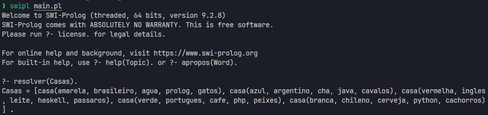
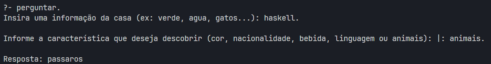

# Enigma de Einstein

**Disciplina**: FGA0210 - PARADIGMAS DE PROGRAMAÇÃO - T01 <br>
**Número do Grupo**: 05<br>
**Paradigma**: Logico<br>

## Alunos
|Matrícula | Aluno |
| -- | -- |
| 18/0015311 |  Danilo Domingo |
| 20/0018442 |  Gabrielly Assunção |
| 19/0030291 |  Jackes Fonseca |
| 20/0021541 |  Karla Chaiane  |
| 17/0039803 | Lucas Medeiros Rosa |
| 18/0042661 | Luís Furtado de Araújo |
| 19/0020814 |  Vinícius Roriz |

## Sobre 

<p align="justify">
Este projeto é uma solução para o famoso Enigma de Einstein, um quebra-cabeça lógico que desafia a capacidade de raciocínio e dedução. O enigma é baseado em uma série de pistas que envolvem cinco casas de diferentes cores, cada uma com características distintas, como a nacionalidade do morador, o tipo de bebida que consome, a linguagem de programação que utiliza e o animal de estimação que possui. A tarefa consiste em determinar quem possui o peixe, utilizando apenas as informações fornecidas nas pistas.
</p>

### Desafio 
O enigma é frequentemente descrito como:

- Existem cinco casas em uma linha, cada uma de uma cor diferente.
- Em cada casa vive uma pessoa de uma nacionalidade diferente.
- Cada pessoa prefere uma bebida diferente, programa em uma linguagem diferente e possui um animal diferente.
- A solução do enigma é descobrir quem tem o peixe, com base nas pistas fornecidas.

<p align="justify">
Este enigma é atribuído a Albert Einstein, <a href="https://www.bbc.com/portuguese/articles/c72gdnynvdvo" target="_blank">que teria afirmado que 98% da população não conseguiria resolvê-lo</a>. A tarefa é resolver este enigma lógico utilizando o Prolog, uma linguagem de programação declarativa que se destaca pela sua capacidade de lidar com problemas de lógica e dedução.
</p>
 
## Uso e Screenshots
Ao rodar o comando `resolver(Casas).`, o programa retornará a lista de todas as casas preenchidas com suas informações.  

<br>

Ao rodar o comando `perguntar.`, o usuário deve então informar uma informação da casa que ele já tem, e depois uma informação daquela casa que ele deseja descobrir.

<br>

## Instalação 
**Linguagens**: Prolog<br>
**Tecnologias**: SWI Prolog<br>

<p align="justify">
Para rodar o projeto será necessário a instalação do SWI Prolog, para fazer sua instalação é simples, pode ser feito via terminal utilizando os seguintes comandos:
</p>

### Linux
```bash
sudo apt-add-repository ppa:swi-prolog/stable
sudo apt update
sudo apt install swi-prolog
```

### MacOS

Caso não tenha o homebrew (gerenciador de pacotes do macOS instalado):
```bash
sudo /bin/bash -c "$(curl -fsSL https://raw.githubusercontent.com/Homebrew/install/HEAD/install.sh)"
sudo brew update
```

Após garantir que o homebrew está instalado, instale o swi-prolog pelo gerenciador de pacotes homebrew:
```bash
sudo brew install swi-prolog
```


### Windows

Uma alternativa para quem utiliza o Windows e não quer fazer a instalação do SWI Prolog via WSL, pode ser instalando o LPA WinProlog, basta baixá-lo [aqui](https://unbbr-my.sharepoint.com/:u:/g/personal/180015311_aluno_unb_br/Ee3LhOEMm9hNuXbuGs3d36ABuSkdLVglZCUPvtECVq_rLg?e=8FiUve), após isso basta extrair e executar o .exe.

## Vídeo

Clique [aqui](https://drive.google.com/file/d/1CDVcOWlnncfYWNEhh_KtaakRjH9hPkp5/view?usp=sharing) para assistir o vídeo.


## Participações
Apresente, brevemente, como cada membro do grupo contribuiu para o projeto.
|Nome do Membro | Contribuição | Significância da Contribuição para o Projeto (Excelente/Boa/Regular/Ruim/Nula) | Comprobatórios (ex. links para commits)
| -- | -- | -- | -- |
| Danilo Domingo Vitoriano Silva  | Participação na elaboração da documentação | Boa | [Adição da identificação do grupo](https://github.com/UnBParadigmas2024-2/2024.2_G5_Logico_Enigma-de-Einstein/commit/7c48de6e073ba2b0d0172cbb719f246281919be9), [Passo a Passo da instalação](https://github.com/UnBParadigmas2024-2/2024.2_G5_Logico_Enigma-de-Einstein/commit/c69cf897557ca4a040f3eee23a14fed0b489b7e7) 
| Gabrielly Assunção | Elaboração do documento | Execlente |[Informações gerais](https://github.com/UnBParadigmas2024-2/2024.2_G5_Logico_Enigma-de-Einstein/commit/befecb5492e62ec3da9f11474065291ad856713d), [Comparação com outras linguagens](https://github.com/UnBParadigmas2024-2/2024.2_G5_Logico_Enigma-de-Einstein/commit/920498465cbd64ea7e30e3ddc2df1a89ca0973df), [Trabalhos futuros](https://github.com/UnBParadigmas2024-2/2024.2_G5_Logico_Enigma-de-Einstein/commit/06feced23010c74e4a90f3f8740c1fce1fd9bff0)
| Jackes Fonseca | Atuei na elaboração do documento sobre um comparativo entre a solução usando paradigma lógico e funcional | Boa | https://github.com/UnBParadigmas2024-2/2024.2_G5_Logico_Enigma-de-Einstein/commit/1bb533a1ba029774550e7c78d7ccf711e218e4c2
| Karla Feliciano   | Codificação da funcionalidade de fazer perguntas ao programa | Boa | [Persistência de informações descorbertas](https://github.com/UnBParadigmas2024-2/2024.2_G5_Logico_Enigma-de-Einstein/commit/738a1e8833776009f9f5bc745f86266e3e1bf5da), [Predicado de perguntas](https://github.com/UnBParadigmas2024-2/2024.2_G5_Logico_Enigma-de-Einstein/commit/ccec32d31f7aaadc1accce15eff7c287c1cec6a4)
| Lucas Medeiros Rosa | Contribui com a escolha do tema. Gerei e analisei o trace de deduções utilizado pelo prolog para chegar ao resultado final | Excelente | [Commit](https://github.com/UnBParadigmas2024-2/2024.2_G5_Logico_Enigma-de-Einstein/commit/977a0cd0b958c3779609fe5239a07bb5b56edd19)
| Luís Furtado de Araújo  | Codificação da funcionalidade de fazer perguntas ao programa, Instalação e execução do programa no ambiente MacOS | Boa | [Predicado de perguntas](https://github.com/UnBParadigmas2024-2/2024.2_G5_Logico_Enigma-de-Einstein/commit/ccec32d31f7aaadc1accce15eff7c287c1cec6a4), [Instalação e execução ambiente MacOS](https://github.com/UnBParadigmas2024-2/2024.2_G5_Logico_Enigma-de-Einstein/commit/f46071fb99b09591ff81ce964fc2380e14208d7c)
| Vinícius Roriz | Resolução do problema | Excelente | [Commit](https://github.com/UnBParadigmas2024-2/2024.2_G5_Logico_Enigma-de-Einstein/commit/8fcd7b71acc8cc2af86a9525f5f91a0f0fe93fe3)

## Outros 
### I. Licões Aprendidas

#### Danilo Domingo

<p align="justify"> Compreendi como o paradigma lógico permite lidar com problemas complexos de forma natural, baseando-se em relações e inferências, como é possível alcançar soluções robustas ao focar na definição precisa do problema, em vez de construir algoritmos detalhados passo a passo. Mesmo sem entender perfeitamente o paradigma, consegui perceber outro método de resolver problemas computacionais. </p>

#### Gabrielly Assunção

<p align="justify">
Uma das maiores lições foi entender e aplicar o paradigma lógico, que é muito diferente do paradigma orientado a objetos com o qual eu já estava mais acostumada. Em prolog, o destaque está na descrição do problema e das suas restrições, deixando para o motor de inferência o papel de encontrar a solução. Esse tipo de abordagem mudou minha maneira de pensar sobre problemas computacionais, despertando um raciocínio mais lógico e sistemático.
</p>

#### Jackes Fonseca

<p align="justify">
A resolução do Problema de Einstein permitiu explorar diferenças entre os paradigmas declarativo e funcional. No paradigma declarativo, exemplificado por Prolog, o foco está em declarar fatos e regras, com a lógica inferencial automatizada, facilitando a resolução de problemas de satisfação de restrições (CSPs). Já no funcional, representado por Haskell, a solução requer o uso explícito de funções e estruturas como permutações, tornando o código mais detalhado, mas flexível.
</p>

<p align="justify">
Prolog demonstrou uma grande eficiência nativa em CSPs devido ao backtracking automatizado. Haskell, apesar da clareza e controle nas etapas, teve menor eficiência inicial por usar força bruta. A experiência incluiu o uso de ferramentas como SWI-Prolog e GHC/GHCi, evidenciando diferenças no fluxo de desenvolvimento e depuração. Em síntese, Prolog é ideal para lógica declarativa, enquanto Haskell brilha em problemas que demandam flexibilidade funcional.
</p>

#### Karla Feliciano

<p align="justify">
Usar Prolog e o paradigma lógico me ensinou a pensar de forma diferente do raciocínio linear tradicional para abordar problemas de maneira declarativa. Percebi o poder de expressar soluções complexas com poucas palavras, o que torna a importante entender bem a lógica por trás para não se perder. É um paradigma que tem muito poder e com poucas palavras consegue fazer muita coisa, então precisei me adaptar para utilizar as funções, ou implementar novas.
</p>

#### Lucas Medeiros

<p align="justify">
Acredito que a maior lição aprendida após essa atividade foi adiquirir um conhecimento mais profundo de como o prolog processas as informações fornecidas para chegar ao resultado final. Durante as aulas, apesar de compreender a teoria da busca em profundidade do Prolog, não estava tão claro para mim como a linguém de fato operava para resolver as questões. Além disso uma aplicação prática me ajudou a sair da teoria e ver as possibilidades do prolog como ferramenta.
</p>

#### Luís Furtado

<p align="justify">
A maior lição e aprendizado que tive foi entender através do paradigma lógico de pensar em outro fluxo de resolução de problemas, onde caminhamos para definir os predicados, representações de lógicas ou propriedades que dizem serem verdadeiras ou falsas, para assim garantir o fluxo do programa através desses predicados já definidos. Entendi também que para alguns determinados problemas (como o de Einstein), o paradigma lógico pode ser muito interessante em questões de performance, mas também podem gerar diversos problemas de manutenabilidade, evolução e escalabilidade, dependendo do tamanho de dados a serem considerados para o problema.
</p>

#### Vinícius Roriz

<p align="justify">
Ao decorrer deste projeto, aprendi a abordar o problema de forma declarativa, e que no Prolog o foco está em descrever o que é verdade ao invés de encontrar a solução, o que gera a necessidade de definir restrições claras e evitar contradições. Trabalhar com o backtracking se provou um ponto forte da linguagem, que automaticamente reformulava as suas hipóteses quando recebia uma nova informação que contradizia a solução que estava sendo criada. Apesar de acabar não usando alguns recursos como os cortes (!) no trabalho, gostei de aprender sobre eles nas aulas e tenho interesse em utilizar a linguagem novamente no futuro.
</p>

### II. Percepções

#### Comparação Com Outras Linguagens

<p align="justify"> 
A solução para o Enigma de Einstein foi abordada de diferentes formas ao longo dos anos, com destaque para implementações em várias linguagens, como Haskell. Por exemplo, o <a href="http://blog.darrenstruthers.net/2012/10/solving-einsteins-puzzle-with-haskell.html" target="_blank">código aqui descrito</a> apresenta uma versão do enigma resolvida utilizando a programação funcional, uma abordagem que pode ser comparada ao paradigma lógico que usamos no Prolog.  Veja <a href="https://github.com/UnBParadigmas2024-2/2024.2_G5_Logico_Enigma-de-Einstein/blob/main/doc/Relat%C3%B3rio%20Paradigma%20L%C3%B3gico.pdf" target="_blank">aqui</a> a comparação entre o enigma resolvido em Haskell e Prolog.
</p>

<p align="justify"> Embora o enigma de Einstein possa ser resolvido com outras linguagens de programação, o uso de Prolog oferece uma série de vantagens notáveis em termos de clareza e eficiência para problemas de lógica.</p>

<p align="justify"> Se compararmos a resolução em Prolog com linguagens como python, solução utilizaria estruturas de dados mais complexas como listas e dicinários, além de funções recursivas para simular o backtracking. A implementação em python não aproveita as otimizações nativas de inferência lógica, o que pode resultar em um desempenho inferior em comparação com o Prolog.
</p>

### III. Contribuições e Fragilidades

#### Danilo Domingo

<p align="justify">
Contribui mais para a parte da documentação, na construção do Readme, também participei de forma mais tímida na escolha do problema a ser solucionado, pois não participei de todas as aulas e estava um pouco deslocado em relação ao paradigma, devido a isso optei a participar mais ativamente na documentação do projeto.
</p>

#### Gabrielly Assunção

<p align="justify">
Minha contribuição no projeto dependeu significativamente do trabalho inicial realizado pelos meus colegas, especialmente no que diz respeito à resolução do problema lógico. Essa dependência pode ser vista como uma fragilidade, já que minha participação na implementação do código foi limitada. Ainda assim, me mantive focada em revisar e compreender a lógica desenvolvida, buscando agregar valor por meio de suporte e colaboração.A divisão de tarefas e o escopo reduzido do software também limitaram meu envolvimento direto no desenvolvimento lógico. Além disso, minha falta de prática com Prolog impactou minha atuação de forma mais técnica. 
</p>
<p align="justify">
Apesar dessas limitações, me mantive disponível para ajudar meus colegas sempre que necessário, seja revisando trechos de código, discutindo dúvidas conceituais ou validando ideias .Assumi, também, a responsabilidade pela documentação do projeto, o que foi uma contribuição essencial para o sucesso do trabalho. Organizei informações, contextualizei  e revisei cada detalhe da documentação, garantindo que fosse clara, bem estruturada. Meu objetivo foi garantir a qualidade do documento, tanto em termos de apresentação quanto de conteúdo, contribuindo para que o projeto fosse compreendido de maneira integral por qualquer leitor.
</p>
<p align="justify">
Embora minha participação tenha se concentrado na documentação e no apoio ao grupo, acredito que agreguei valor em aspectos fundamentais para um trabalho acadêmico, como clareza, organização e revisão crítica. Reconheço minhas limitações no desenvolvimento técnico e vejo essa experiência como uma oportunidade de aprendizado. Em projetos futuros, pretendo aprofundar meu envolvimento na parte lógica, ampliando minha contribuição de forma mais equilibrada entre o código e outros aspectos complementares do projeto.
</p>


#### Jackes Fonseca

<p align="justify">
Minha contribuição se concentrou basicamente em explorar as diferenças entre os paradigmas lógico e funcional e documenta-las. Acredito que tenha tirado um bom aprendizado sobre ambos os paradigmas. Acredito que a maior fragilidade do projeta tenha sido o escopo pequeno onde envolvia pouco código o que fez com que a equipe teve que ser dividida em dois grupos: desenvolvimento e documentação, mas mesmo isso, não foi impeditivo de aprender novos coneitos, ferramentas, etc.
</p>

#### Karla Feliciano

<p align="justify">
Fiquei responsável pela parte de permitir que o usuário fizesse perguntas ao programa. Então mesmo que o prolog naturalmente devolva variáveis ao usuário, adaptei para que a interação fosse mais intuitiva ao usuário. Durante a realização do código tive algumas dificuldades com as mensagens de erro que recebia, já que algumas vezes não era informada a linha do erro ou era pouco detalhado o problema ocorrido, porém apesar de haver menos conteúdos da linguagem na internet consegui recorrer a ajuda de outros usuários em fóruns.
</p>

#### Lucas Medeiros

<p align="justify">
Minha primeira contribuição no projeto foi o próprio tema, eu fui o integrante que deu a ideia de criar um programa em Prolog capaz de resolver o famosos Desafio de Lógica de Einstein. Com a contribuição de outros colegas chegamos na objetivo final de mostrar ao usário o caminho de deduções até o resultado. Após essa decição fiquei responsável por gerar o caminho dedutivo do Prolog, tafera que realizei utilizando o `trace`, nativo do Prolog.
</p>
<p align="justify">
Acredito que minha maior fragilidade nesse projeto foi não ter sido capaz de gerar a sequência de deduções de maneira simple para o usuário.
</p>

#### Luís Furtado

<p align="justify"> 
Participei da implementação de permitir que o usuário fizesse perguntas ao programa, também na lógica de adicionar dinamicamente fatos ou regras a base de conhecimento para que pudesse ser utilizada depois pelo predicativo de fazer perguntas ao programa. Minha maior dificuldade foi entender como poderia ser resolvido o problema através da estrutura do prolog e entender como o paradigma lógico funcionava. Depois de entender isso, foi um pouco mais fácil de implementar. Também tive um pouco de dificuldade para configurar o ambiente no ambiente MacOS, onde deixei a contribuição no Readme para rodar nesse ambiente.
</p>

#### Vinícius Roriz

<p align="justify"> 
Para desenvolver a solução, primeiro fui descobrir como outras linguagens resolviam o problema. Uma que me chamou atenção foi uma resolução na linguagem R, que encontrava as respostas aplicando restrições, por exemplo: é criado um array com 5 casas e aplicada uma restrição que diz que existe uma Casa neste array em que a nacionalidade é Inglês e a cor é Vermelha. Através de um conjunto de restrições, a linguagem encontra a única distribuição das variáveis que supre todas as necessidades sem repetir nenhuma informação.

Essa solução me pareceu se encaixar bem com o paradigma funcional adotado pelo Prolog, então a usei como base para resolver esse enigma para o projeto. Assim como na solução em R, criamos uma lista de casas com as informações iniciais vazias, e depois informamos as nossas restrições através dos predicados `member`, para dicas que envolvem duas informações para uma casa, `ao_lado`, para dicas que envolvem uma informação para uma casa e outra para a casa vizinha, e `a_esquerda`, que só é utilizada uma vez para indicar que a casa verde está à esquerda da branca.

Tive dificuldades para mudar a forma em que penso no problema, principalmente em descrevê-lo de forma declarativa, focando mais nas relações entre os dados e nas regras que definem seu comportamento. Outra coisa que me bagunçou foi a falta de controle explícito do fluxo de execução, em alguns momentos eu queria usar um `if` mas tive que encontrar maneiras de evitar fazê-lo.
</p>

### IV. Trabalhos Futuros

<p align="justify">
O projeto apresenta diversas possibilidades de evolução e melhorias de código torná-lo mais robusto. Abaixo estão algumas sugestões da equipe para trabalhos futuros:
</p>
<p align="justify">
1. Modularização do código, divindindo a lógica de resolução, separando os predicados principais das funções auxiliares, facilitando a escalabilidade do código.
</p>
<p align="justify">
2.  Criar uma interface para interação com o usuário, permitindo que perguntas sejam feitas de maneira intuitiva, sem a necessidade de comandos Prolog.
</p>
<p align="justify">
3. Melhorar as validações de entrada para assegurar que as inconsistências dsejam tratadas corretamente.
</p>
<p align="justify">
4. Criar testes unitários.
</p>
<p align="justify">
5. Atualmente a solução é armazenada em tempo de execução, sendo interessante evoluir para persistir em um banco de dados.
</p>

## Fontes

> [Solving Einstein's puzzle with constraint programming](https://www.r-bloggers.com/2021/09/solving-einsteins-puzzle-with-constraint-programming/).  Acesso em: 09 nov. 2024.

> [SWI-PROLOG. SWI-Prolog documentation](https://www.swi-prolog.org/pldoc/index.html).  Acesso em: 09 nov. 2024.

> [BBC News Brasil: Como resolver o Enigma de Einstein](https://www.bbc.com/portuguese/articles/c72gdnynvdvo).  Acesso em: 11 nov. 2024.

> [Solving Einstein's Puzzle with Haskell](http://blog.darrenstruthers.net/2012/10/solving-einsteins-puzzle-with-haskell.html).  Acesso em: 11 nov. 2024.
